# 4.27源码版打包HTML5的流程
# 先叠满保护buff（不想看可以跳这一节）

## 出处
这是根据我在油管上发现的一个[视频](https://www.youtube.com/watch?v=vCfXeYRll_E&t=889s)。如果想锻炼一下解决问题的能力，可以按照该视频走一下。然后你会按照我的流程来做的。

## 我能提供哪些帮助
我只是一个菜鸡，我只会上百度解决问题。所以你按照我的力流程来做，**我不保证你能百分百成功，我只是把我趟过的写出来了。所以你有其他问题我不会回答，也不知道。**

## 我能提供“下载”的工具吗？
不会，除了必须要安装的程序之外我不会多说一个工具。插件推荐也不是刚需。请自行辨别需求使用。我也不会传我下载好的代码。编译好的UE。因为UE源码实在是太大了流量不够用

## 编译源码的环境
- 笔记本
- Win10最新系统(11也行但没试过)
- IntelI7十二代处理器
- 硬盘两个1T固态（用上源码就别舍不得你的固态了，折磨你心态还是折磨你固态你应该能知道）
- IDE：VisualStudio2022（19好像也可以但是没试，也别问我为什么22之外的IDE出什么错了我不知道）

## 版权问题
  本文档禁止售卖，原作者是[BILIBILI：c釸晨](https://space.bilibili.com/320495524?spm_id_from=333.1007.0.0)。如果使用了本文中的内容。请将本教程地址添加到你的作品中。
  其他例如代码版权[看Github上项目的授权介绍吧](https://github.com/SpeculativeCoder/UnrealEngine-HTML5-ES3)
  
  >感谢名单：
  >- 感谢大佬“[与一糖糖]()”解决在科学网络下**运行`HTML5Setup.sh`依然出错的问题**以及**正确解决UBT提示node最新版本的文件无法找到的问题。已删除原本修改文件夹的编译方式。**（按照其本人意愿只显示Bilibili的用户名而不是用户主页）。问题形成原因会在之后写出。

## 教程可能有时效问题
本教程存在一定局限性。有时出问题可以尝试换一台电脑重新开始（有案例说明和电脑系统的环境有关）。如果按照本文没有成功打包请通过bilibili联系我。我会把现象写在这里面等下一个勇士揭榜。

## 如何联系我
我不看github的Issues。请从[我的Bilibili](https://space.bilibili.com/320495524?spm_id_from=333.1007.0.0)联系我

## 最后一个BUFF
如果你没事干，可以看原作者的视频或者文档。我一半左右都是抄他的，甚至有直接机翻Copy的。所以我一问三不知。

# 准备工作
- 确定你的IDE支持编译UEC++项目，并且安装VS2022，使用Win10的C++SDK（Win11的SDK也可以。但是需要一些额外的步骤。有能力的自己解决，没信心的就别折腾了。解决办法我下次更新再说。）
- [加入UE开发者（单击查看教程）](https://www.unrealengine.com/zh-CN/ue-on-github)，因为使用的是UE4.27源码版的分支。
- [克隆4.27 HTML5 ES3 (WebGL2)项目](https://github.com/SpeculativeCoder/UnrealEngine/tree/4.27-html5-es3)。（[GitHub项目首页](https://github.com/SpeculativeCoder/UnrealEngine-HTML5-ES3)）
- 安装[Git for Windows](https://git-scm.com/downloads)
- 安装[CMake](https://github.com/Kitware/CMake/releases/download/v3.27.0-rc3/cmake-3.27.0-rc3-windows-x86_64.msi)(不能是VS里面安装的Cmake)且安装过程中必须点击**Add CMake to the system PATH for all users**

安装的步骤参照下图（觉得太啰嗦了跳过这一组图）
1. 点击勾选框后点击next

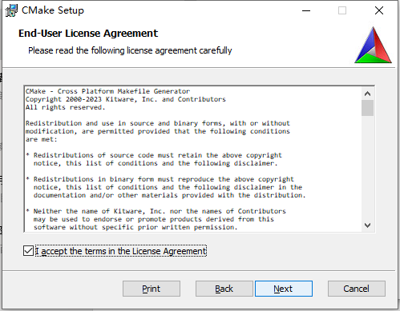

2. 点击**Add CMake to the system PATH for all users**后点击next

3. 点击next

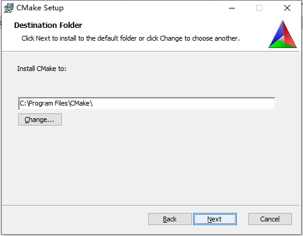

4. 点击next弹窗后点是没弹窗不管

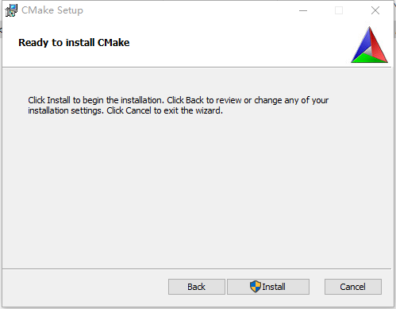

5. 点击Finish

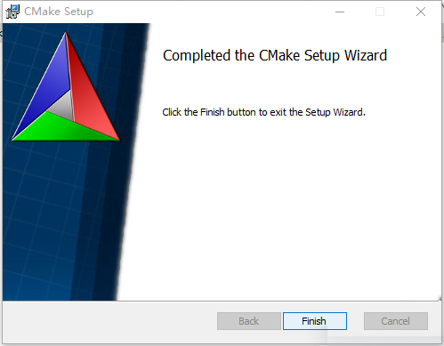

6. 在git bash中输入`cmake --version`确保正确返回版本信息（如下图）如果没有出现，可以重启一下电脑

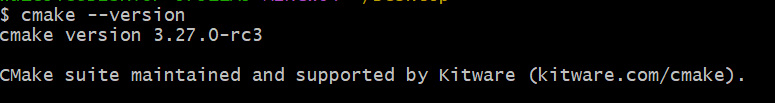

- Python 3.*(我在VS里安装了，可以在cmd中输入python查看python版本。Github上原话：(watch out for Windows Python app installer "app execution aliases" which may cause problems - recommend setting these to disabled - see 
[this Stack Overflow post](https://stackoverflow.com/a/61958044)))

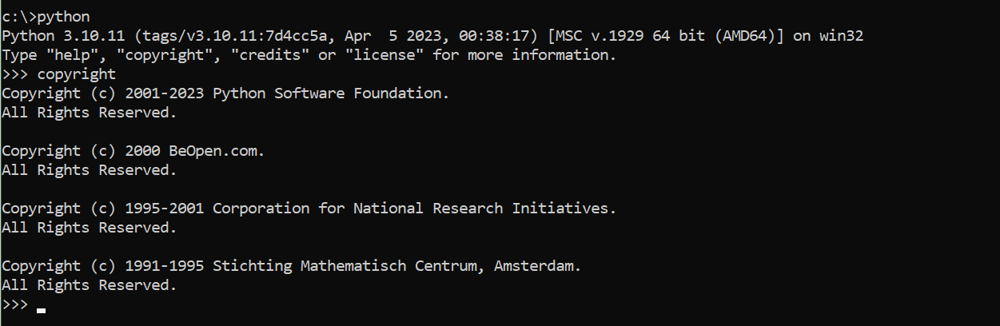

# 开始安装

## 1.克隆项目
  git地址。git bash里面输入下方代码后会让你授权git

  `git clone -b 4.27-html5-es3 --single-branch https://github.com/SpeculativeCoder/UnrealEngine.git ue-4.27-html5-es3`

- 提一句，如果你总是下载失败，可以试试只克隆最新的内容。我直接使用GitHub Desktop总是克隆失败。git bash里面输入浅克隆代码：`git clone --depth 1 https://github.com/SpeculativeCoder/UnrealEngine.git ue-4.27-html5-es3`

## 2. 替换依赖文件
  根据Epic Games的声明，你需要根据你所使用的引擎版本，将Engine/Build文件夹中的commit.gitdepth.xml替换为Epic新提供的版本。需要从下面相关UnrealEngine版本的Assets部分[下载最新的Commit.gitdeps.xml](https://github.com/EpicGames/UnrealEngine/releases/tag/4.27.2-release)，并用它替换你的Engine/Build文件夹中的文件

  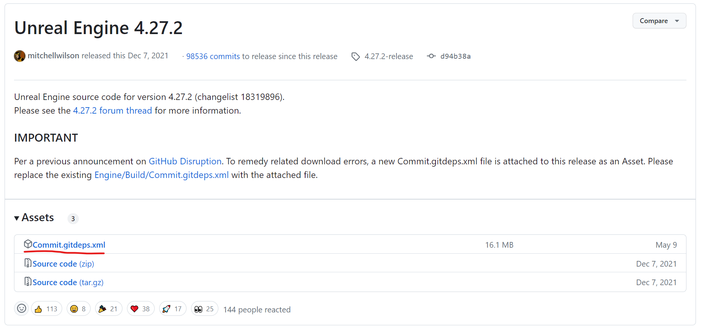

  下载后替换到

  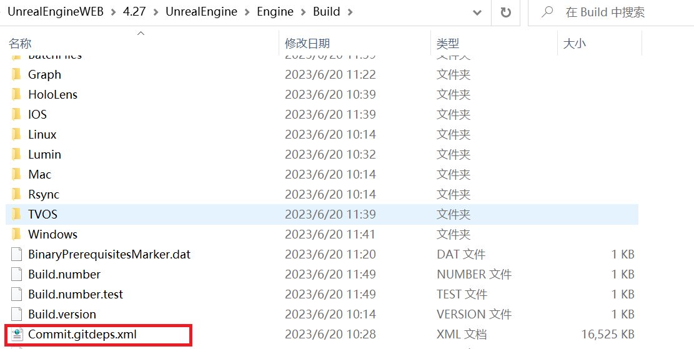

## 3. 运行Setup.bat下载依赖资源
  回到你的Git克隆的位置点击Setup.bat。你会进入漫漫的等待期。到这一步为止都可以参考其他编译源码版的文章。还可以启用多线程加速下载（但是我这里网差没效果）。
  如果你看到一个关于远程服务器返回错误或403 / Forbidden的错误，那么你可能没有正确应用上面的committee.gitdepth.xml修复。
  如果需要加速下载，可以输入`Setup.bat --threads=10`其中10表示线程数量。请结合自身硬件合理设置该值。当然，网速太慢不会有很大的提升。

## 4. 下载打包HTML5的依赖代码
进入`Engine\Platforms\HTML5`路径你会看到有个`HTML5Setup.sh`文件。空白处右键点击GitBashHere。如果你没有这个，需要安装Git。如果你是Win11系统。展开更多选项即可

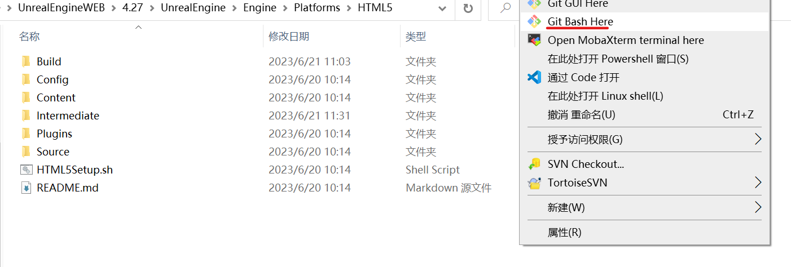

- Tips：需要换个网络下载，不然下载不成功，哪怕是HK或者其他网络也不行
- **下载成功标识**这个操作是对UnrealEngine源代码进行一系列修复，下载emscripten SDK并构建各种支持库(例如PhysX)。这需要一段时间。在最后，一些通知声音将播放，让你知道它完成了，你应该看到一行`Success!`在一堆信息的最后面。如果你看不到`Success!`这一行，那么就有问题了，任何进一步的步骤都会遇到问题。HTML5Setup.sh步骤的任何问题也经常会使Engine/Platforms/HTML5/Build/emsdk处于损坏状态，因此删除该目录才能重试。
- 如果运行没几次就报错了并且提示：**无法解析命令CMake**,**无法运行什么什么二进制文件**。需要使用上面的链接安装CMake
- 7月31号更新，个别电脑会出现运行完毕，但是依赖库未下载完成。（类似下图）这个问题由 **“[与一糖糖]()”大佬解决的**并且由其他不愿透露姓名的大佬补充。请看4.1

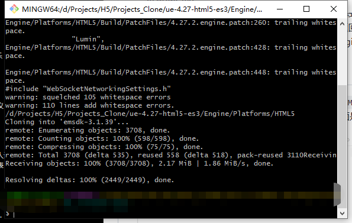

### 4.1 在网络通常（梯子访问通畅）的时候运行HTML5Setup.sh后未出现`Success`时
- 问题原因：git bash没有获取到emsdk的环境。导致之后的操作都不成功
- 手动删除Engine/Platforms/HTML5/Build/emsdk里面的内容（如果有的话）
- 请检查是否是CMake环境原因
- 检查是否是python环境原因

> #### 4.1.1 获取合适的emsdk源码
> - 使用记事本方式打开HTML5Setup.sh脚本。查看脚本中的EMVER值。例如图中的地址为：3.1.39。则需要在github中下载发布版的3.1.39,或者按我接下来的步骤做
> 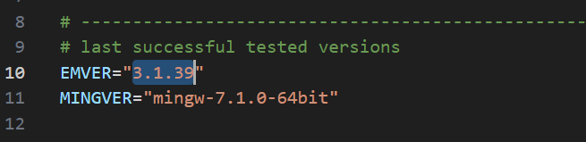
> - 进入`Engine/Platforms/HTML5/Build/emsdk`文件夹在git bash中输入`git clone https://github.com/emscripten-core/emsdk`拉取emsdk源码或者下载发布的压缩包。如果是使用bash中克隆的emsdk。则还需要在bash中输入`cd emsdk`将路径切换到拉取的emsdk中，然后再执行`git checkout 3.1.39`**注意，这里的3.1.39是你在打开HTML5Setup.sh脚本中查看到的的EMVER值。切勿按本教程填入3.1.39**
> - 修改拉取的emsdk文件夹名字改为emsdk加HTML5Setup.sh脚本脚本中EMVER的值。例如本教程中本应该设置为：`emsdk-3.1.39`**但是3.1.39和3.1.42兼容。之后的3.1.42在结果上来说和3.1.39等价。我也懒得改截图了**打开修改名称后的文件夹，在该目录下运行powershell 输入`.\emsdk.bat install 3.1.42`注意！！3.1.42是HTML5Setup.sh脚本脚本中EMVER的值。可能随着版本更迭，需要替换为其他值。
> - 命令运行完之后输入不要关闭窗口，输入：`.\emsdk.bat install mingw-7.1.0-64bit`
> - 命令运行完之后输入不要关闭窗口，输入：`.\emsdk.bat activate 3.1.42`注意！！3.1.42是HTML5Setup.sh脚本脚本中EMVER的值。可能随着版本更迭，需要替换为其他值。
> - 命令运行完之后输入不要关闭窗口，输入：`.\emsdk_env.bat`
> - 确保文件夹结构如下，如果不同。则检查网络后重新install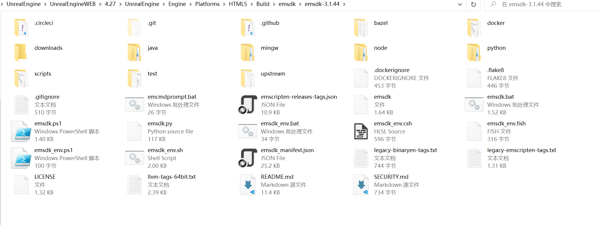
> - 运行HTML5Setup.sh脚本。
> - （出现Success则忽略这一步。）运行HTML5Setup.sh脚本如果没有出现`Success`则进入`Engine\Platforms\HTML5\Build\BatchFiles`打开`Build_All_HTML5_libs.sh`将第四行用#注释掉，然后取消注释第五行（去掉#）查看报错提示已知的报错提示是CMake报错，有版本不对问题，缓存问题（如果有其他的报错请通过[BILIBILI：c釸晨](https://space.bilibili.com/320495524?spm_id_from=333.1007.0.0)联系我）如果CMake报错的话直接去`\Engine\Platforms\HTML5`搜索CMakeCatch.List文件，这个是运行时的缓存文件，有它在必定会阻止CMake运行。安装正确版本并且删除CMakeCatch.List后再去git bash里运行HTML5Setup.sh脚本
> - 成功时的界面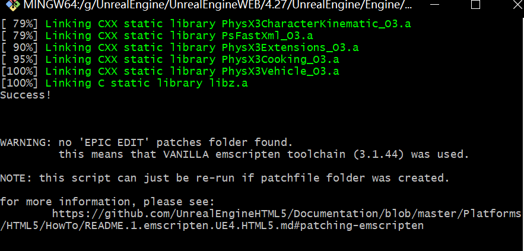
## 5. 修改版本号
打开Engine\Platforms\HTML5\Source\Programs\UnrealBuildTool\HTML5SDKInfo.cs将其中23行的NODE_VER为你`Engine\Platforms\HTML5\Build\emsdk\emsdk-3.1.39\node`中的名字。

## 6.开始常规的编译源码流程
1. 回到引擎源码的根目录下运行GenerateProjectFiles.bat
2. Open UE4.sln
3. 然后严格按照下面的步骤进行

## 7. 添加依赖的项目
你首先需要将HTML5LauncherHelper项目添加到解决方案中…要做到这一点，右键单击Programs，然后添加->现有项目，然后将该地址下的文件添加到解决方案:`Engine\Platforms\HTML5\Source\Programs\HTML5\HTML5LaunchHelper\HTML5LauncherHelper.csproj`
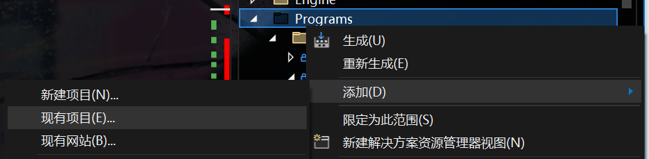

点击下面的文件

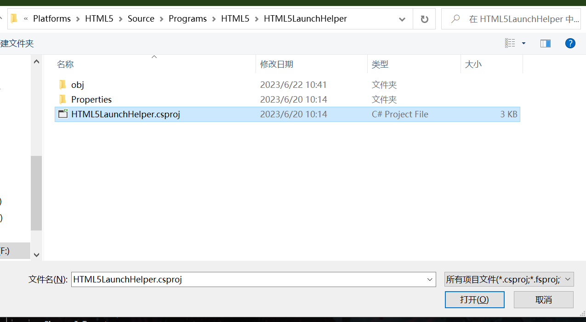

## 8. 编译依赖的项目
按住Ctrl按键点击项目可多选。然后点击生成选定内容。下面的项目是必须编译的
- UE4
- AutomationTool
- AutomationToolLauncher
- HTML5LaunchHelper
- ShaderCompileWorker
- UnrealBuildTool
- UnrealFrontend
- UnrealHeaderTool
- UnrealLightmass
- UnrealPak

漫长的等待后你就能使用UE4.27了但是这时候有一些设置可以帮助到你

# 最终注意事项
1. 项目打开后请设置移动端抗锯齿级别为没有抗锯齿
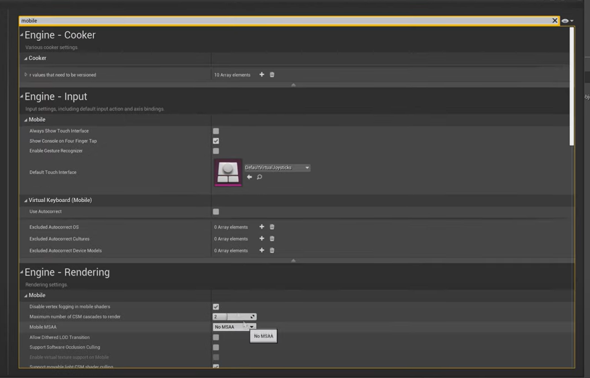
2. 项目的平台设置中HTML5取消多线程支持
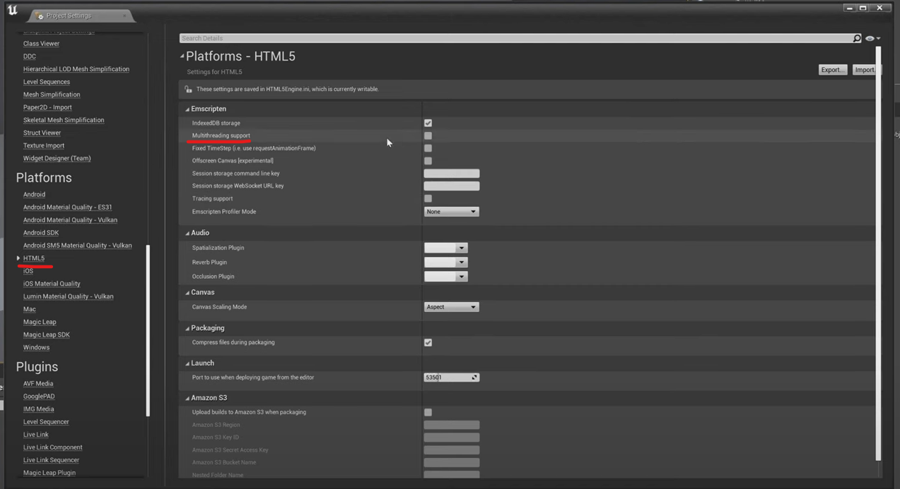
3. 最好打包为Shipping发布版。除非你有能力解决Out of Memory

开始享受吧

# 末尾的推荐设置以及一些说明

## 1. 创建方式
`Engine\Binaries\Win64\UE4Editor.exe`是编辑器的地址。可以直接创建桌面快捷方式了

## 2. 设置着色器缓存
老生常谈了，自己百度

## 3. HTML5使用WebSocket和HTTP与服务器通信
知道的人可能觉得没啥但是踩坑时真的容易崩溃。目前虚幻商城上WebSocket相关的插件在该源码版本上无法打包H5平台后使用。本人正在着手解决这个问题。如果有最新进展。我会在此贴上websocket插件。

HTTP通信插件推荐使用开源的VaRest

## 4. HTML5不支持用了多线程的插件

## 5. 大部分二进制插件都不支持HTML5（我认为不可能会支持除非你用的是有源码的插件）

## 6. 绝对不支持的插件列表
> - CesiumForUnreal
>
>   因为官方不支持，并且使用了许多第三方库作为SDK。有案例表明可以支持他，但是要钱。
> - WebUI
> 
>   因为WebUI是通过嵌入Chrome内核浏览器方式将网页内容嵌入到UI中。所以你说浏览器嵌入浏览器运行方式能成功吗？
> - 虚幻商城中的所有WebSocket插件
> - RuntimeFBXImport 天下大了无奇不有。你猜猜它为什么会出现在这里。
> - 缓慢更新中

## 7. 推荐使用的插件列表
### 7.1 网络通信
> - [Varest(点击直达Github仓库)](https://github.com/ufna/VaRest)
> 
> 推荐理由：为H5平台提供HTTP通信。是一个免费开源还牛逼的插件。支持二进制内容传输，插件还支持Json，并且使用非常简单。
### 7.2 资产清理工具
> - [assets cleaner project cleaning tool（点击直达虚幻商城）](https://www.unrealengine.com/marketplace/en-US/product/assets-cleaner-project-cleaning-tool)
> 
> 推荐理由：H5平台对包大小很敏感。清理无用的资产可以减少打包之后的包大小。