# 4.27源码版打包HTML5的流程
# 先叠满保护buff（不想看可以跳这一节）

## 出处
这是根据我在油管上发现的一个[视频](https://www.youtube.com/watch?v=vCfXeYRll_E&t=889s)。如果想锻炼一下解决问题的能力，可以按照该视频走一下。然后你会按照我的流程来做的。

## 我能提供哪些帮助
我只是一个菜鸡，我只会上百度解决问题。所以你按照我的力流程来做，**我不保证你能百分百成功，我只是把我趟过的写出来了。所以你有其他问题我不会回答，也不知道。**

## 我能提供“下载”的工具吗？
不会，除了必须要安装的程序之外我不会多说一个工具。我也不会传我下载好的代码。编译好的UE。因为UE源码实在是太大了流量不够用

## 编译源码的环境
- 笔记本
- Win10最新系统(11也行但没试过)
- IntelI7十二代处理器
- 硬盘两个1T固态（用上源码就别舍不得你的固态了，折磨你心态还是折磨你固态你应该能知道）
- IDE：VisualStudio2022（19好像也可以但是没试，也别问我为什么22之外的IDE出什么错了我不知道）

## 版权问题
  本文档禁止售卖，原作者是[BILIBILI：c釸晨](https://space.bilibili.com/320495524?spm_id_from=333.1007.0.0)。
  其他例如代码版权[看Github上项目的授权介绍吧](https://github.com/SpeculativeCoder/UnrealEngine-HTML5-ES3)

## 教程可能有时效问题
本教程可能在一段时间之后不再有效果。但是如法炮制应该是能走通的。

## 最后一个BUFF
如果你没事干，可以看原作者的视频或者文档。我一半左右都是抄他的，甚至有直接机翻Copy的。所以我一问三不知。

# 准备工作
- 确定你的IDE支持编译UEC++项目，并且安装VS2022，使用Win10的C++SDK
- [加入UE开发者（单击查看教程）](https://www.unrealengine.com/zh-CN/ue-on-github)，因为使用的是UE4.27源码版的分支。
- [克隆4.27 HTML5 ES3 (WebGL2)项目](https://github.com/SpeculativeCoder/UnrealEngine/tree/4.27-html5-es3)。（[GitHub项目首页](https://github.com/SpeculativeCoder/UnrealEngine-HTML5-ES3)）
- 安装[Git for Windows](https://git-scm.com/downloads)
- 安装[CMake](https://github.com/Kitware/CMake/releases/download/v3.27.0-rc3/cmake-3.27.0-rc3-windows-x86_64.msi)(不能是VS里面安装的Cmake)且安装过程中必须点击**Add CMake to the system PATH for all users**
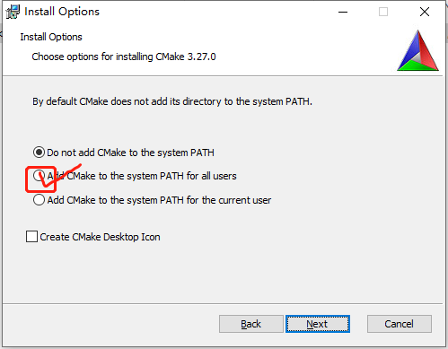

安装的步骤参照下图（觉得太啰嗦了跳过这一组图）
1. 点击勾选框后点击next
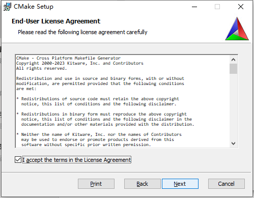
2. 点击**Add CMake to the system PATH for all users**后点击next

3. 点击next
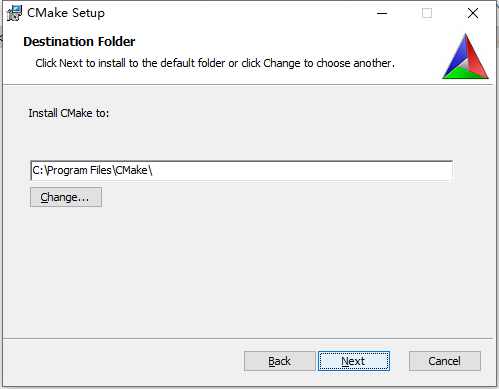
4. 点击next弹窗后点是没弹窗不管
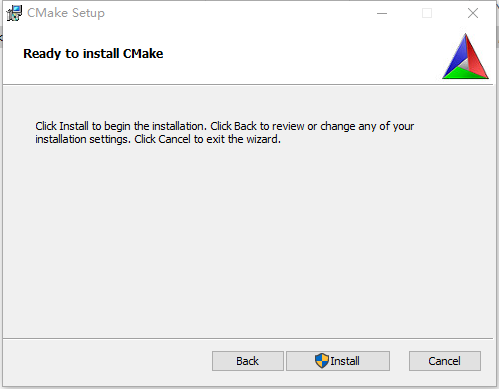
5. 点击Finish
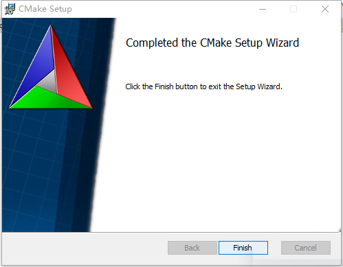

- Python 3.*(我在VS里安装了，可以在cmd中输入python查看python版本。Github上原话：(watch out for Windows Python app installer "app execution aliases" which may cause problems - recommend setting these to disabled - see [this Stack Overflow post](https://stackoverflow.com/a/61958044)))
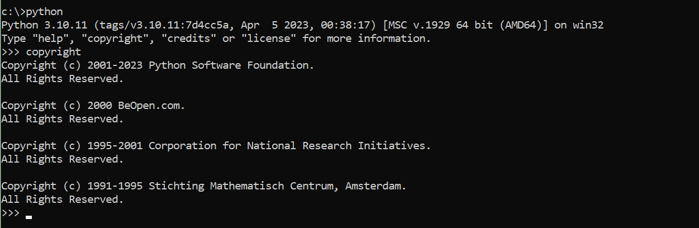

# 开始安装

## 1.克隆项目
  git地址。git bash里面输入下方代码后会让你授权git

  `git clone -b 4.27-html5-es3 --single-branch https://github.com/SpeculativeCoder/UnrealEngine.git ue-4.27-html5-es3`

- 提一句，如果你总是下载失败，可以试试只克隆最新的内容。我直接使用GitHub Desktop总是克隆失败。git bash里面输入浅克隆代码：`git clone --depth 1 https://github.com/SpeculativeCoder/UnrealEngine.git ue-4.27-html5-es3`

## 2. 替换依赖文件
  根据Epic Games的声明，你需要根据你所使用的引擎版本，将Engine/Build文件夹中的commit.gitdepth.xml替换为Epic新提供的版本。需要从下面相关UnrealEngine版本的Assets部分[下载最新的Commit.gitdeps.xml](https://github.com/EpicGames/UnrealEngine/releases/tag/4.27.2-release)，并用它替换你的Engine/Build文件夹中的文件
  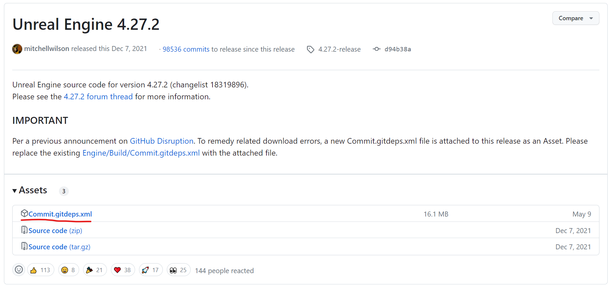
  下载后替换到
  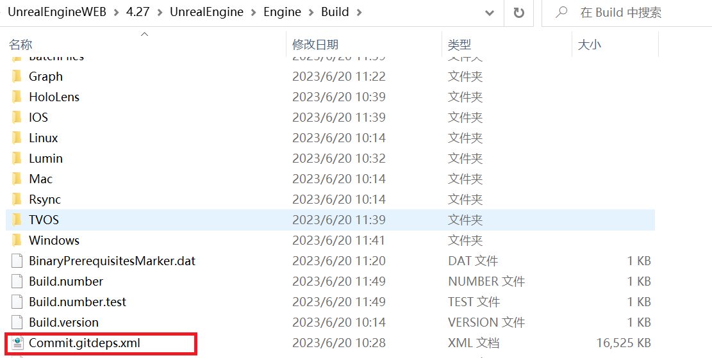

## 3. 运行Setup.bat下载依赖资源
  回到你的Git克隆的位置点击Setup.bat。你会进入漫漫的等待期。到这一步为止都可以参考其他编译源码版的文章。还可以启用多线程加速下载（但是我这里网差没效果）。
  如果你看到一个关于远程服务器返回错误或403 / Forbidden的错误，那么你可能没有正确应用上面的committee.gitdepth.xml修复。

## 4. 下载打包HTML5的依赖代码
进入`Engine\Platforms\HTML5`路径你会看到有个`HTML5Setup.sh`文件。空白处右键点击GitBashHere。如果你没有这个，需要安装Git。如果你是Win11系统。展开更多选项即可
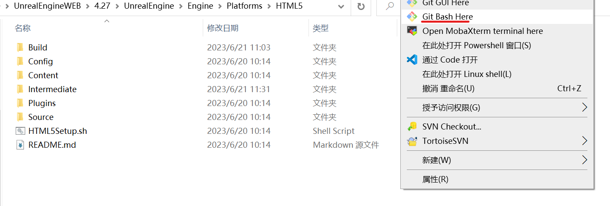
- Tips：需要换个网络下载，不然下载不成功，哪怕是HK或者其他网络也不行
- **下载成功标识**这个操作是对UnrealEngine源代码进行一系列修复，下载emscripten SDK并构建各种支持库(例如PhysX)。这需要一段时间。在最后，一些通知声音将播放，让你知道它完成了，你应该看到一行`Success!`在一堆信息的最后面。如果你看不到`Success!`这一行，那么就有问题了，任何进一步的步骤都会遇到问题。HTML5Setup.sh步骤的任何问题也经常会使Engine/Platforms/HTML/Build/emsdk处于损坏状态，因此删除该目录才能重试。
- 如果运行没几次就报错了一定是没安装CMake。我出现的情况有:**无法解析命令CMake**,**无法运行什么什么二进制文件**。需要使用上面的链接安装CMake
- 7月2号更新，个别电脑会出现运行完毕，但是依赖库未下载完成。（如下图）这个目前并没有找到原因。如果有解决的朋友可以通过B站联系我。我将更新该文档。让大家为虚幻的社区贡献自己的一份力吧！
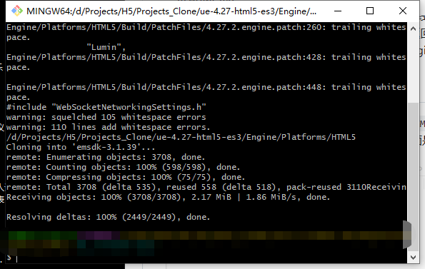

## 5. 修改版本号
这时候别高兴，这里需要改个文件夹名字。不然编译不过
进入`Engine\Platforms\HTML5\Build\emsdk\emsdk-3.1.39\node`文件夹后你会打开这个文件夹（废话活跃气氛）将现有的文件夹名字改成`15.14.0_64bit`。如果你打开后出现的文件夹名字就是这个，那么恭喜你，我不知道啥情况。本人下载后出现的是`16.20.0_64bit`上图
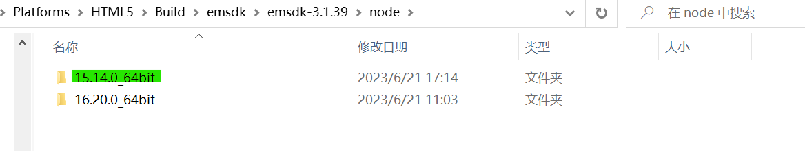

## 6.开始常规的编译源码流程
1. 回到引擎源码的根目录下运行GenerateProjectFiles.bat
2. Open UE4.sln
3. 然后严格按照下面的步骤进行

## 7. 添加依赖的项目
你首先需要将HTML5LauncherHelper项目添加到解决方案中…要做到这一点，右键单击Programs，然后添加->现有项目，然后将该地址下的文件添加到解决方案:`Engine\Platforms\HTML5\Source\Programs\HTML5\HTML5LaunchHelper\HTML5LauncherHelper.csproj`
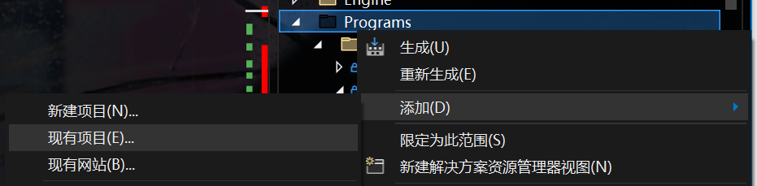
点击下面的文件
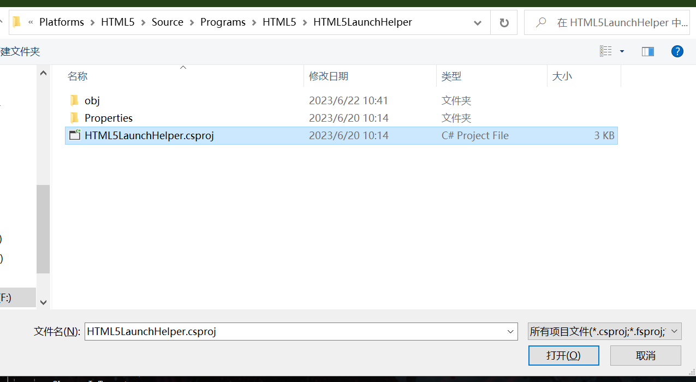

## 8. 编译依赖的项目
按住Ctrl按键点击项目可多选。然后点击生成选定内容。下面的项目是必须编译的
- UE4
- AutomationTool
- AutomationToolLauncher
- HTML5LaunchHelper
- ShaderCompileWorker
- UnrealBuildTool
- UnrealFrontend
- UnrealHeaderTool
- UnrealLightmass
- UnrealPak

漫长的等待后你就能使用UE4.27了但是这时候有一些设置可以帮助到你

# 最终注意事项
1. 项目打开后请设置移动端抗锯齿级别为没有抗锯齿
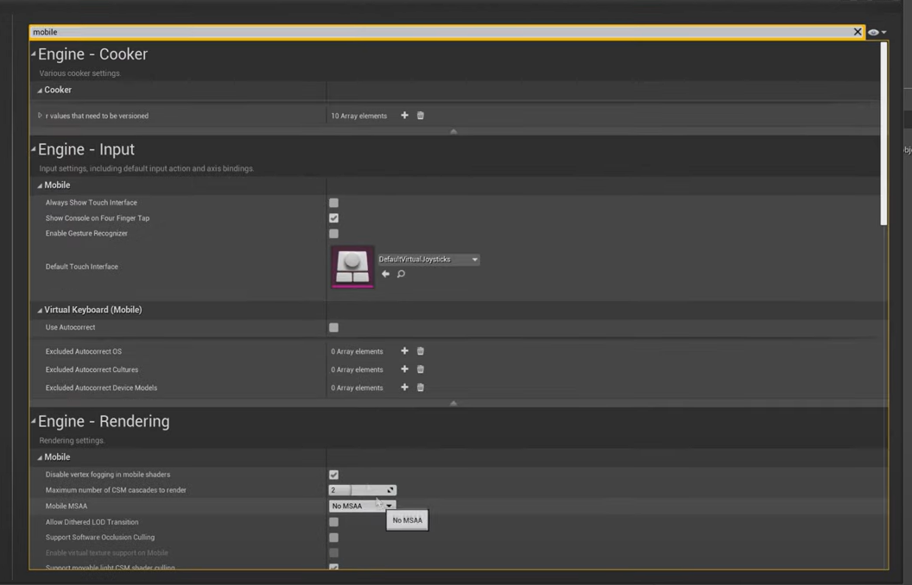
2. 项目的平台设置中HTML5取消多线程支持
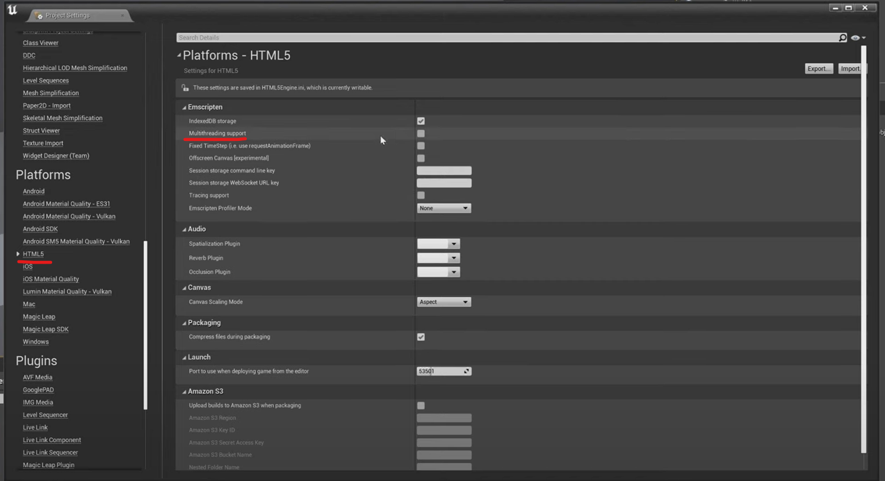
3. 最好打包为Shipping发布版。除非你有能力解决Out of Memory

开始享受吧

# 末尾的推荐设置

## 1. 创建方式
`Engine\Binaries\Win64\UE4Editor.exe`是编辑器的地址。可以直接创建桌面快捷方式了

## 2. 设置着色器缓存
老生常谈了，自己百度

## 3. HTML5使用WebSocket与服务器通信
知道的人可能觉得没啥但是踩坑时真的容易崩溃

## 4. HTML5不支持用了多线程的插件

## 5. 大部分二进制插件都不支持HTML5（我认为不可能会支持）

